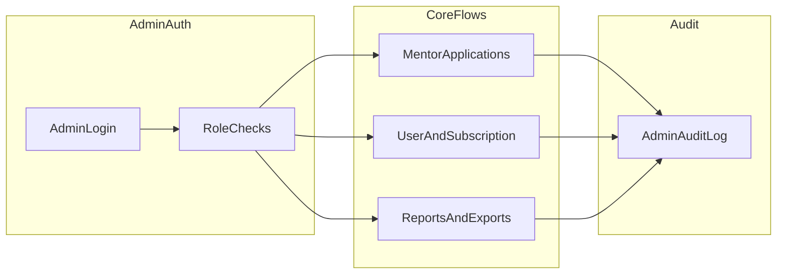

# Admin Portal — Product & Technical Specification

This document merges the **product outline** for the Spiriment admin experience with **technical additions** recommended for API and admin webapp implementation. Copy sections into Google Docs as needed.

---

## Part A — Product specification (overview)

### A.1 Admin roles and access

| Role                    | Capabilities                                                                                                   |
| ----------------------- | -------------------------------------------------------------------------------------------------------------- |
| **Super Admin**         | Full control over all data, settings, and users.                                                               |
| **Support / Moderator** | Limited access: review mentor applications, handle reports; **cannot** change billing or system-wide settings. |

### A.2 Admin home dashboard

**Key cards**

- Total users (mentees / mentors)
- Active subscriptions (Basic / Pro / Premium)
- Pending mentor applications (e.g. “7 awaiting review”)
- Active church and family plans

**Quick links**

- Review Mentor Applications
- View Support Tickets
- Export Monthly Report

Goal: high-level picture and shortcuts to common admin tasks.

### A.3 Mentor application and approval process

#### A.3.1 Mentor application flow (high level)

1. Mentor applies inside the app.
2. Form: personal info, church info, experience, references, areas of mentoring, languages, etc.
3. Optional uploads: letter from church, certificates, etc.
4. Application appears in Admin Portal with status **Pending**, visible under Mentor Applications.
5. Admin reviews: profile details, answers, documents; optional **internal notes** (not visible to mentor).
6. Admin decision: **Approve**, **Reject**, or **Request more information**.
7. System notifies mentor: **email + in-app notification** using templates (see A.3.3).

#### A.3.2 Mentor applications — admin screen

Per application, admin can see:

- **Basic info**: Name, email, country, age range; languages spoken.
- **Church and ministry**: Church name and denomination; role in church (e.g. youth leader, pastor); years of mentoring/teaching experience.
- **Spiritual and mentoring**: Areas to mentor in; availability (days/times); short testimony/motivation.
- **Verification**: Reference contact (pastor/leader email); uploaded documents if any.
- **System**: Date applied; status (Pending, Approved, Rejected, Needs more info); **admin notes** (internal only).

**Actions**

- Approve mentor
- Reject mentor
- Mark as “Needs more information”
- Add internal note (e.g. “Waiting for email from pastor”)

#### A.3.3 Approval / rejection messages (admin → mentor)

Templates are **pre-defined but editable**. Admin sees a **preview** before sending and may edit for special cases.

**Channels**: Email + in-app notification (and push where product requires—see Part B.3).

**a) Approval**

- Clear approval statement.
- Next steps: complete profile, set availability, review code of conduct.
- Links: mentor onboarding guide or dashboard.

Example subject: `Your Spiriment Mentor Application Has Been Approved`

**b) Rejection**

- Polite explanation; optional custom note (e.g. recommend re-applying later).

Example subject: `Your Spiriment Mentor Application`

**c) Needs more information**

- List missing items (e.g. pastor’s email).
- Clear instructions to resubmit.

### A.4 Ongoing mentor management (after approval)

**Mentor list**

- Search and filter: name, country, language, church, status.

**Per-mentor detail**

- Profile; active/expired subscriptions; session stats (sessions, mentees served); reports/flags from mentees.

**Actions**

- Temporarily suspend mentor
- Permanently remove mentor
- Send direct message (e.g. request availability update)
- Change mentor type or discount (e.g. mentor Bible discount)

### A.5 User and subscription management (high level)

**User management**

- View all users (mentors + mentees).
- Search/filter: role, country, subscription tier, church/family.
- Subscription history and current tier.
- Manually apply or remove discounts (goodwill cases).

**Subscription oversight**

- Counts on Basic / Pro / Premium.
- Active family and church plans.
- High-level monthly revenue report.

---

## Part B — Suggested technical additions

### B.1 Security, access control, and compliance

- **Admin identity model**: Decide whether admins are **separate admin accounts** or **elevated app users** with an `adminRole` (Super Admin / Support). This drives JWT claims and login flows.
- **Enforcement matrix**: Use **Part C — RBAC matrix** for every route and screen. “Authenticated only” is insufficient for production on admin-adjacent endpoints (e.g. mentor pending list, broadcasts).
- **Audit log**: Record who performed sensitive actions (approve/reject mentor, suspend user, discount changes, data export), timestamp, optional IP/session id, and before/after where useful—for disputes and debugging.
- **Session hardening** (optional): 2FA for Super Admin; shorter admin session lifetime; optional IP allowlist in production.
- **Data protection**: Rules for viewing PII; document downloads via **signed URLs with expiry**; **GDPR-style** export/delete if operating in EU/UK—who may trigger and what is anonymized vs deleted.

### B.2 Application lifecycle and data model (mentor flow)

- **State machine** (align with `mentorApprovalStatus` on `User`, `isApproved` / `approvalNotes` on `MentorProfile`, and admin approval flows in `mentorProfile.service.ts`):

  `draft` → `submitted` → `pending_review` → `approved` | `rejected` | `needs_more_info` → (if needs info) resubmission loop.

- **Production vs current backend behavior**: Onboarding completion must **not** auto-approve in production. Today `completeOnboarding` may auto-approve for testing; the spec should require switching to **pending** until admin approval.
- **Application vs profile**: Clarify if an “application” is an immutable **snapshot** (submitted answers + documents) separate from live profile edits, and whether admins always judge the **submitted snapshot**.
- **Attachments**: Max file size, allowed MIME types, virus scanning policy, retention after rejection.

### B.3 Notifications and messaging (implementation-ready)

- **Template registry**: Stable IDs (e.g. `mentor_application_approved_v1`), default subject/body, placeholders (`{{firstName}}`, `{{dashboardUrl}}`, etc.). Define whether Support edits **per send only** or Super Admin can also set **org-wide defaults**.
- **Channels**: Map each action to email / in-app / push (existing code sends push on some approval paths).
- **Idempotency**: Prevent duplicate emails when admin double-submits (e.g. idempotency key or disable-after-click).
- **Deep links**: Exact URLs for complete profile, code of conduct, resubmit application.

### B.4 Support tickets and reports

- **Source of truth**: In-app tickets only vs external tool (Zendesk, Intercom). If external, document SSO/deep links or webhooks for “View Support Tickets.”
- **Mentee reports**: Triage queue; link to session/conversation where policy allows; severity; assignment to Support; resolution states; whether reporter gets a follow-up message.

### B.5 User and subscription management — extra detail

- **Definitions**: What counts as **active subscription** (paid, trialing, grace period, canceled-but-valid-until-period-end)—dashboard cards depend on this.
- **Church / family plans**: Admin actions—create plan, add/remove seats, transfer billing admin, view invoice history (Support may be read-only).
- **Discounts**: Types (percentage, fixed, coupon), duration, audit requirement, which role may apply (Super Admin only vs Support with limits).
- **Manual overrides**: Refunds, comp access, fraud holds—which role can perform each.

### B.6 Ongoing mentor management — operational detail

- **Suspend vs remove**: What mentees see (e.g. “unavailable”); whether active sessions are canceled; whether mentor retains read-only login.
- **Direct message**: In-app only vs email; whether messages are **tracked** for compliance.
- **Mentor type / discount**: Enumerate mentor types and effects on discovery, pricing, badges.

### B.7 Dashboard and reporting

- **Time zones**: UTC vs org timezone for “monthly” reports and revenue.
- **Export contents**: Minimum columns (users, subscriptions, applications in/out, sessions completed, churn) so backend CSV/API matches expectations.
- **Performance**: Pagination and filters on large lists; optional **async export** (email link when file is ready).

### B.8 Non-functional requirements (engineering)

- **Rate limits** on admin APIs and export endpoints.
- **Observability**: Structured logs for admin actions; alerts on failed transactional emails (e.g. approval).
- **Feature flags**: Roll out application or admin features without exposing incomplete UI.

### B.9 Explicit non-goals (optional)

Examples: no user impersonation in v1; no in-app admin chatbot—reduces scope creep.

### B.10 Diagram (auth → core → audit)



---

## Part C — RBAC matrix (route / screen × role)

Legend: **Y** = allowed, **N** = denied, **R** = read-only where noted.

### C.1 Admin webapp screens

| Screen / area                                | Super Admin | Support / Moderator                         |
| -------------------------------------------- | ----------- | ------------------------------------------- |
| Dashboard (aggregates)                       | Y           | Y                                           |
| Mentor applications (list + detail + decide) | Y           | Y                                           |
| Mentor list + detail (post-approval)         | Y           | Y                                           |
| Suspend / remove mentor                      | Y           | Y (confirm policy; if restricted, set to N) |
| Send direct message to mentor                | Y           | Y                                           |
| User list + user detail (PII)                | Y           | Y                                           |
| Apply / remove discount                      | Y           | N (or Y with limits—document in policy)     |
| Subscription / revenue reports               | Y           | R or N (no billing change)                  |
| Church / family plan billing admin           | Y           | N                                           |
| System-wide settings                         | Y           | N                                           |
| Support tickets / reports queue              | Y           | Y                                           |
| Export monthly report (PII-heavy)            | Y           | R or N per policy                           |
| Admin user / role management                 | Y           | N                                           |
| Audit log viewer                             | Y           | R or N per policy                           |

_Adjust cells marked “per policy” to match legal/compliance._

### C.2 API routes (planned — see Part D)

| Route group                                           | Super Admin | Support / Moderator |
| ----------------------------------------------------- | ----------- | ------------------- |
| `GET /api/admin/dashboard/*`                          | Y           | Y                   |
| `GET/POST/PATCH .../mentor-applications/*`            | Y           | Y                   |
| `POST .../mentor-applications/:id/decision`           | Y           | Y                   |
| `GET/PATCH .../users/*` (non-billing)                 | Y           | Y                   |
| `POST .../users/:id/discounts`                        | Y           | N                   |
| `GET .../subscriptions/revenue`                       | Y           | R or N              |
| `POST .../church-plans/*`, `family-plans/*` (billing) | Y           | N                   |
| `GET/PATCH .../settings/*`                            | Y           | N                   |
| `POST .../broadcast-push` (existing)                  | Y           | N or Y per policy   |
| `GET .../audit-log`                                   | Y           | R or N              |

Existing mentor-profile admin routes (e.g. pending list, approve) should be **folded under** `/api/admin/...` or protected with the same middleware as Part D.

---

## Part D — Planned `/api/admin` API surface and list rules

Base path: **`/api/admin`** (already mounted in `root.route.ts`). All routes require **admin JWT** (or session) with role claim; apply RBAC from Part C.

### D.1 Authentication

- `POST /api/admin/auth/login` — admin credentials → tokens (if separate admin auth).
- `POST /api/admin/auth/refresh`
- `POST /api/admin/auth/logout`

_If admins are app users with a flag, reuse existing auth and issue role-scoped tokens._

### D.2 Dashboard

- `GET /api/admin/dashboard/summary` — user counts, subscription breakdown, pending application count, active church/family plan counts (query params for date range if needed).

### D.3 Mentor applications

- `GET /api/admin/mentor-applications` — list with filters (`status`, `country`, `dateFrom`, `dateTo`, `search`).
- `GET /api/admin/mentor-applications/:id` — full detail including internal notes and document metadata/URLs.
- `POST /api/admin/mentor-applications/:id/notes` — append internal note.
- `POST /api/admin/mentor-applications/:id/decision` — body: `{ action: approve | reject | needs_more_info, messageOverride?, templateId? }`; triggers notifications per Part B.3.
- `GET /api/admin/message-templates/:templateId` — preview defaults (optional).

### D.4 Mentors (post-approval)

- `GET /api/admin/mentors` — list with filters (name, country, language, church, status).
- `GET /api/admin/mentors/:userId` — profile + subscriptions summary + session stats + flags.
- `PATCH /api/admin/mentors/:userId/status` — suspend / unsuspend / remove (soft-delete policy in body).
- `POST /api/admin/mentors/:userId/messages` — admin-initiated message (in-app and/or email per product).

### D.5 Users and subscriptions

- `GET /api/admin/users` — list with filters (role, country, tier, church/family linkage).
- `GET /api/admin/users/:userId` — detail including subscription history.
- `POST /api/admin/users/:userId/discounts` — Super Admin only; body defines type, value, duration.
- `DELETE /api/admin/users/:userId/discounts/:discountId`
- `GET /api/admin/subscriptions/summary` — counts by tier; optional revenue aggregates (Super Admin or read-only Support).

### D.6 Church / family plans (Super Admin)

- `GET /api/admin/plans/church` / `GET /api/admin/plans/family` — list active plans.
- `POST`, `PATCH`, `DELETE` variants as product requires (seats, billing admin transfer).

### D.7 Settings and operations

- `GET/PATCH /api/admin/settings` — system-wide settings (Super Admin only).
- `POST /api/admin/broadcast-push` — **existing**; restrict to appropriate role.
- `GET /api/admin/audit-log` — paginated, filter by actor, action type, date range.

### D.8 Exports

- `POST /api/admin/exports/monthly-report` — body: `{ year, month, timezone }`.
  - **Sync** (small tenants): returns file URL or stream immediately.
  - **Async** (large tenants): returns `{ jobId }`; `GET /api/admin/exports/:jobId` returns `pending | ready` and download URL when done (signed URL, short expiry).

### D.9 Pagination, sorting, and filtering (list endpoints)

Common query parameters for all `GET` list endpoints:

| Parameter | Description                                                              |
| --------- | ------------------------------------------------------------------------ |
| `page`    | 1-based page index (default `1`).                                        |
| `limit`   | Page size, max e.g. `100` (default `20`).                                |
| `sort`    | Field name, optional prefix `-` for descending (e.g. `sort=-createdAt`). |
| `search`  | Free text where applicable (name, email).                                |

Response shape (recommended):

```json
{
  "data": [],
  "meta": {
    "page": 1,
    "limit": 20,
    "total": 0,
    "totalPages": 0
  }
}
```

### D.10 Support tickets / reports (when implemented)

- `GET /api/admin/reports` — mentee reports queue with filters.
- `PATCH /api/admin/reports/:id` — assign, change status, resolution notes.

_(Exact paths may align with existing ticket entities if any.)_

---

## Part E — Implementation alignment (mentor-backend)

- **Mentor approval**: Logic exists around `approveMentor`, `getPendingMentors`, and user `mentorApprovalStatus`; extend for reject / needs_more_info and template-driven messages.
- **`/api/admin`**: Currently includes `POST /broadcast-push`; expand per Part D with shared admin auth middleware and RBAC.
- **Email**: `email.service.ts` may still reference legacy branding in some admin templates; align copy and partials with **Spiriment** as templates are added for application decisions.
- **Monthly / reporting**: If monthly summary logic exists elsewhere, wire admin export to the same definitions as dashboard metrics (Part B.5, B.7).
